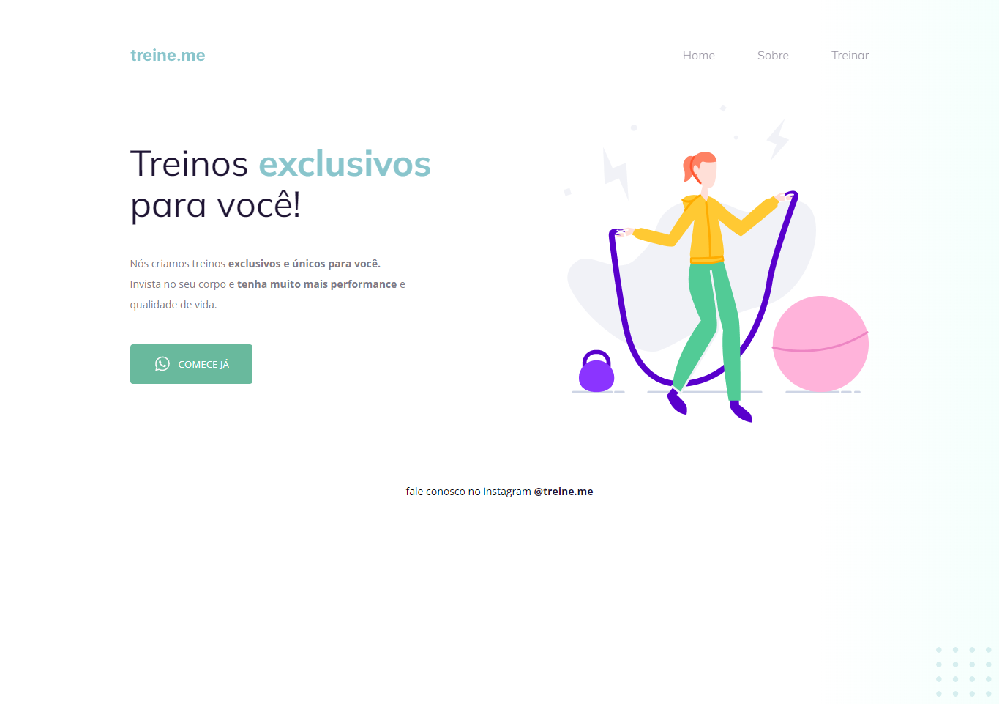

# Curso Explorer Rocketseat

Desafio intermediário - Semântica e acessibilidade.

- O projeto foi passado com uma semântica incorreta utilizando div's, com o intuito de corrigimos os erros na acessibilidade.

[🔗 Clique aqui para acessar]

## 🛠️ Tecnologias

- HTML
- CSS
